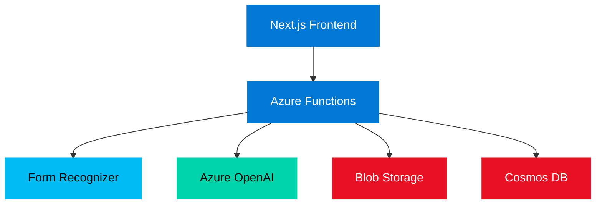

# Smart Invoice Automation System

## Processing Invoices in Seconds with Azure AI

  

    Powered by Azure AI Services
  

---
transition: fade
layout: center
class: text-center
---

# The Problem

## Manual invoice processing takes 3-5 minutes per invoice

<v-clicks>

- 📄 Read vendor name and invoice number
- 📅 Extract date and total amount
- 🏷️ Manually categorize (IT, Office, Marketing, etc.)
- ⌨️ Enter data into accounting system

</v-clicks>

<v-click>

Hours of repetitive work × hundreds of invoices per month

</v-click>

---
transition: fade
layout: center
class: text-center
---

# The Solution

## Automated with Azure AI

<v-clicks>

- 📤 **Upload** - PDF/image
- 🤖 **Extract** - Form Recognizer
- 🧠 **Classify** - OpenAI
- ⚡ **Results** - Seconds

</v-clicks>

<v-click>

</v-click>

---
transition: fade
layout: center
class: text-center
---

# Architecture Overview

---
transition: fade
layout: center
class: text-center
---

# The Processing Pipeline

**Extract Data**
- Form Recognizer analyzes invoice
- Extracts structured data

**Classify**
- OpenAI categorizes invoice
- Returns confidence + reasoning

**Store & Display**
- Saved to Cosmos DB
- Displayed to user in real-time

--- 
transition: fade
layout: center
class: text-center
---

# Live Demo!

---
transition: fade
layout: center
class: text-center
---

# Key Takeaways

<v-clicks>

## 🎯 Azure AI solves real problems
Form Recognizer + OpenAI = powerful automation

## ⚡ Serverless is cost-effective
Perfect for MVPs and production

## 🚀 Modern tooling accelerates dev
Next.js + .NET + TypeScript

## 🔧 Production-ready
Scalable and maintainable

</v-clicks>

---
transition: fade
layout: center
class: text-center
---

# Production Considerations

## Security

<v-clicks>

- 🔐 Authentication
- 🚦 Rate limiting
- 🛡️ Input validation
- 🔄 Retry logic
- 📝 Logging

</v-clicks>

## Features

<v-clicks>

- 📊 App Insights
- 📤 Bulk uploads
- 🔗 Integrations
- 📥 Export (CSV/Excel)
- 🌍 Multi-region

</v-clicks>

<v-click>

Production-ready with these enhancements

</v-click>

---
layout: center
class: text-center
---

# Thank You!

**Ehsan Tatasadi** | Cloud & AI Automation

🔗 github.com/tatasadi

💼 linkedin.com/in/ehsan-tatasadi

If you found this useful, please subscribe and drop a comment!

